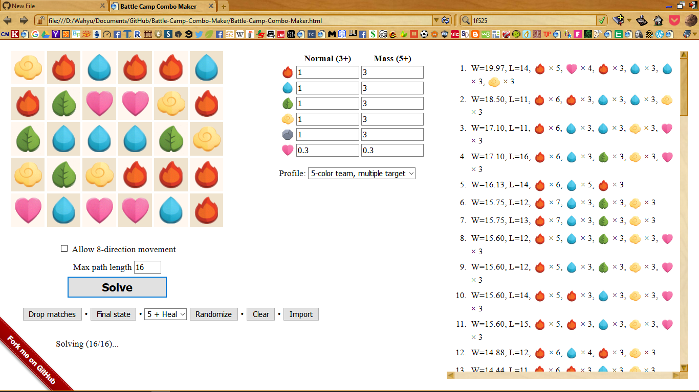

# Battle-Camp-Combo-Maker
=====================================

`Battle-Camp-Combo-Maker` is a Javascript application to find an optimal path leading to a high-combo move in Battle Camp.

This is a modification from pndopt (Puzzle and Dragon Optimizer) by kennytm (https://github.com/kennytm)

Usage
-----

1. Left or right click on an orb to select its type.
2. Click "Solve" after completing the board.
3. Choose one solution and see how it is performed.

Requirements
------------

* Firefox (version 19 or above).
* Screen resolution of 1280×800 or above.

It may work in other configurations but I don't guarantee it will work ☺.

